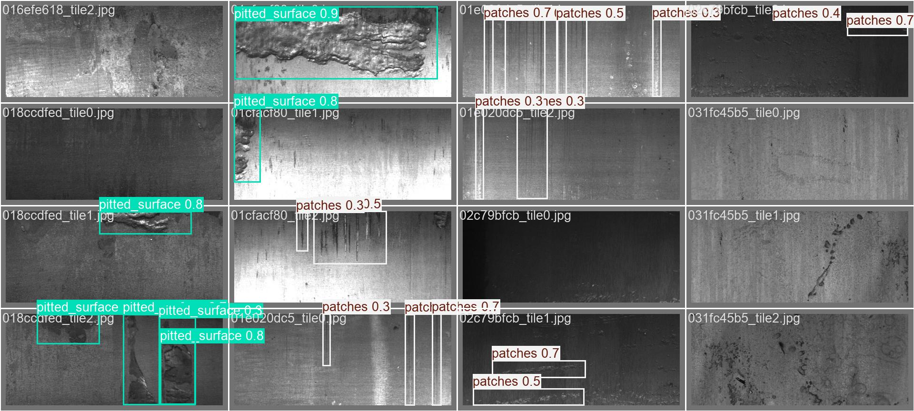
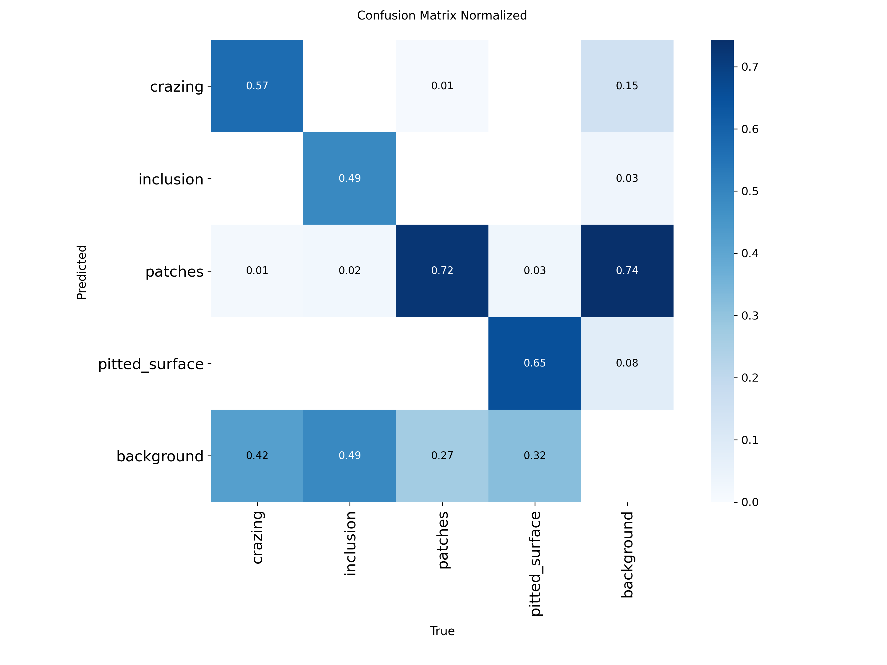

## 🚀 **Live Demo:** [Try the model on HuggingFace Spaces](https://huggingface.co/spaces/ShvetsMaksym/steel-surface-defect-detection-deploy)

---

## 📊 Result at a Glance

| Metric | Performance / Outcome |
|--------|----------------------|
| mAP50 (test) | 0.647 — Baseline YOLOv8m |
| Inference speed | 357ms per image / 119ms per tile |
| Dataset scale | 12,568 images → 37,704 tiles |
| Pipeline | RLE masks → YOLO bboxes, end-to-end |
| Training | 85 epochs on Kaggle T4 GPU |

---

# Severstal Steel Defect Detection

**Object detection** pipeline for industrial steel surface defects using **YOLOv8m**.

This is a real industrial problem — but the dataset comes with **RLE segmentation masks**, not **bounding boxes**. **Segmentation models** are more natural here, but heavier. Since **edge deployment** was a priority, I decided to test how far a **YOLO-based detection** approach could go: convert RLE masks to bounding boxes, handle the unusual image dimensions through **tiling**, and train YOLOv8m on the result. The tradeoff is real — bounding boxes are lossy for diffuse defects like **crazing** — but the experiment shows where detection holds up and where segmentation would genuinely help.

---

## Overview

The dataset contains:
- **12,568** grayscale steel surface images (256×1600)
- **4** defect classes annotated with RLE masks

**Key challenges:**
- RLE masks use 1-indexed, column-major order encoding
- Unusual image dimensions (256×1600) require tiling
- Severe class imbalance: Class 2 has only 247 samples vs 5,150 for Class 3
- 47% of images are defect-free
- Coarse annotations — masks were drawn roughly, reducing bbox precision

---

## Pipeline

1. Decode RLE masks → binary masks per class
2. Slice images into overlapping tiles (256×608, 3 per image)
3. Extract bboxes via connected components analysis
4. Stratified train/val/test split (75/15/10)
5. YOLOv8m training

**Tiling:** Each image is split into 3 overlapping tiles with width 608px (~113px overlap). Overlap ensures defects near tile boundaries appear fully on at least one tile.

**Adaptive thresholds:** Minimum blob area per class was derived from median blob area analysis (`eda/analyze_blobs.py`), using lower thresholds for rare classes to avoid discarding valid annotations.

**Stratified split:** Images are split by original filename (not tile), using class priority order (rarest class first) to ensure rare classes are proportionally distributed across splits.

---

## Experiments

Two training runs were conducted to investigate the effect of class imbalance on model performance.

### Baseline
Standard training on the full dataset with default sampling.

- 85 epochs, batch=32, YOLOv8m pretrained on COCO
- 28,278 tiles (31% defect, 69% defect-free)

### Balanced
An attempt to reduce the impact of class imbalance:
- **Negative undersampling:** A custom `BalancedDetectionTrainer` samples a random subset of negative tiles each epoch (30% of total), without discarding any data — all negatives remain available across epochs.
- **Synthetic inclusion tiles:** 50 augmented samples generated from the 185 real inclusion tiles in the train set (flip + HSV jitter + brightness) to partially compensate for Class 2 scarcity.
- 50 epochs, batch=8, starting from pretrained COCO weights.

---

## Results (Test Set)

| Model    | mAP50 | mAP50-95 | Precision | Recall |
|----------|-------|----------|-----------|--------|
| Baseline | 0.647 | 0.385    | 0.612     | 0.625  |
| Balanced | 0.598 | 0.337    | 0.631     | 0.574  |

**Per-class mAP50 (Baseline):**

| Class         | mAP50 | Recall |
|---------------|-------|--------|
| crazing       | 0.556 | 0.579  |
| inclusion     | 0.552 | 0.532  |
| patches       | 0.759 | 0.741  |
| pitted_surface| 0.689 | 0.647  |

The balanced experiment did not improve overall metrics, likely due to fewer training epochs (50 vs 85) and the OOM-forced batch size reduction from 32 to 8, which introduced noisy gradients.

  
   <em>Baseline predictions on test set</em>

  
   <em>Normalized confusion matrix — Baseline (test set)</em>

The baseline model processes a full 256×1600 image in ~357ms on CPU (3 tiles sequentially, ~119ms each).

> [!NOTE]
> Inference benchmarked on CPU (AMD Ryzen 5 3600, 6-core).

---

## Deployment

The model is deployed as a Gradio app on [HuggingFace Spaces](https://huggingface.co/spaces/ShvetsMaksym/steel-surface-defect-detection-deploy) (CPU Basic, free tier).

### **Stack** 
YOLOv8m + Gradio + HuggingFace Spaces

### **Pipeline** 
full 256×1600 image → 3 overlapping tiles → YOLOv8m inference → cross-tile NMS → result image + JSON output.

### **Inference time**
| Environment | Time per image |
|-------------|---------------|
| Local CPU (AMD Ryzen 5 3600) | ~357ms |
| HuggingFace Spaces (CPU Basic) | ~50s |

The latency difference is expected — HuggingFace free tier uses shared CPU with minimal resources. Local benchmark reflects real-world edge deployment performance.

---

## Future Work

- **Segmentation model:** U-Net with EfficientNet-B0 backbone can use the original RLE masks directly, avoiding the lossy RLE→bbox conversion. Segmentation is better suited for diffuse defects like crazing.
- **Cascade architecture:** YOLO detects defect regions, a lightweight classifier refines the class prediction — trading latency for recall.
- **REST API & Docker:** Production-ready FastAPI endpoint containerized with Docker for scalable deployment.

---

> Full source code, preprocessing pipeline, and Kaggle training notebooks are in this repository.  
> Deployment app (Gradio): [HuggingFace Spaces](https://huggingface.co/spaces/ShvetsMaksym/steel-surface-defect-detection-deploy)  
> Baseline weights (85 epochs): [HuggingFace Models](https://huggingface.co/ShvetsMaksym/yolo_steel_defect_detection/blob/main/best.pt)
